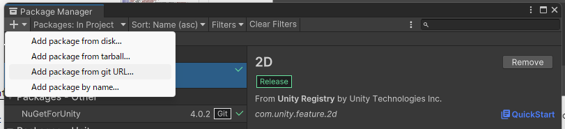

# ForTem SDK Documentation

## Overview

The ForTem SDK provides a consumer-friendly wrapper around the ForTem Web3 Gaming API. It simplifies authentication, user management, and NFT collection operations for Unity games.

Main API documentation can be found at [docs.fortem.gg](https://docs.fortem.gg/)

Minimum supported Unity version: 2021.2

## Package Installation

This package is designed to be installed via Git URL.

```
https://github.com/ForTemLabs/fortem-sdk-unity.git?path=Packages/com.fortem.fortem-sdk
```

If you want to control when this package updates in your project you can append a version to the end of the git url like `#v1.0.0`. For example:

```
https://github.com/ForTemLabs/fortem-sdk-unity.git?path=Packages/com.fortem.fortem-sdk#v0.3.0
```



## Key Features

- **Authentication** - Authentication flow is handled behind the scenes
- **User Lookup** - Query user information by wallet address
- **Collection Management** - Create and browse game NFT collections
- **Item Management** - Create and query NFT items
- **Image Upload** - Upload item images via IPFS integration
- **Debug Logging** - Optional detailed logging for development
- **Environment Support** - Seamlessly switch between Testnet and Mainnet

## Quick Start

### 1. Initialize the SDK

Login to https://testnet.fortem.gg or https://fortem.gg to get your API key.

```csharp
using ForTemSdk;

var config = new ForTemConfig(
    apiKey: "your-api-key",
    environment: ForTemEnvironment.Testnet,
    debugLogging: true
);

var forTemClient = new ForTemClient(config);
```

### 2. Get User Information

```csharp
GetUserResponse user = await forTemClient.UserApi.GetUser(walletAddress: "0x...");
Debug.Log($"Collection: {JsonUtility.ToJson(user, true)}");
// Example response:
// {
//   "isUser": true,
//   "nickname": "6f0b8ffc0d11",
//   "profileImage": "profile/default.png",
//   "walletAddress": "0x904bb53d5508de51fdf1d3c3960fd597e52cb39ae11c562ca22f1acbb2702d8b"
// }
```

### 3. Browse Collections

```csharp
List<CollectionResponse> collections = await forTemClient.CollectionApi.GetCollections();
Debug.Log($"Collections: {JsonUtility.ToJson(collections, true)}");
// Example response:
// [{
//     "id": 50,
//     "objectId": "0x5809794eaab2324dfd04fc2ef572574fdff559b3d97e598f72652fa136ea314e",
//     "name": "collection",
//     "description": "collection description",
//     "tradeVolume": "0",
//     "itemCount": 0,
//     "createdAt": 1761812950000,
//     "updatedAt": 1761812958000
// }]
```

### Image Uploads

Uploaded image dimensions must be no bigger than 256x256. We provide a utility to convert textures and sprites to byte array while also resizing if necessary. Also handles sprites within a texture atlas.

```csharp
byte[] spriteData = ImageUtil.SpriteToByteArray(selectedItem.Sprite);
byte[] textureData = ImageUtil.TextureToByteArray(selectedItem.Sprite);
```

## Endpoints

### Authentication
- `POST /api/v1/developers/auth/nonce` - Get authentication nonce
- `POST /api/v1/developers/auth/access-token` - Get access token

### User
- `GET /api/v1/developers/users/:walletAddress` - Get user by wallet address

### Collections
- `GET /api/v1/developers/collections` - List all collections
- `POST /api/v1/developers/collections` - Create collection

### Items
- `GET /api/v1/developers/collections/:collectionId/items/:code` - Get item by code
- `POST /api/v1/developers/collections/:collectionId/items` - Create item
- `PUT /api/v1/developers/collections/:collectionId/items/image-upload` - Upload image
